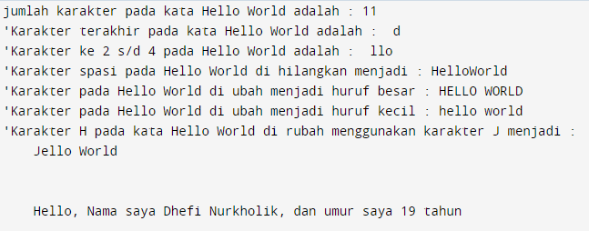

# Praktikum12
# **Operasi String**


**Apa itu Python String ?**

### **String adalah urutan simbol yang terbatas yang dipilih dari himpunan yang disebut alfabet.**

- String adalah jenis yang paling populer di Python.
- Untuk membuatnya hanya dengan melampirkan
  karakter dalam tanda kutip.
- Python memperlakukan tanda kutip tunggal sama
  dengan tanda kutip ganda.
- Membuat string semudah memberi nilai pada sebuah
  variabel.
  <br>

## **main.py**

### **OUTPUT PROGRAM**



### **Deskripsi**

**1. Bagaimana menghitung jumlah karakter pada string ?**
<br>
cara menghitung karakter pada string yaitu menggunakan method **len( )**
<br>
Contoh:

```sh
print(len('Hello World'))
```

methode len() pada python di gunakan untuk menghitung karakter pada string.
<br>
<br>
**2. Bagaimana cara mengambil satu karakter pada string ?**
<br>
cara mengambil satu karakter pada string yaitu dengan menggunakan kurung siku [ ] dan deklarasi nomor di dalam kurung siku dengan urutan **ARRAY** dan menggunakan titik dua lalu masukan nomor **ARRAY** selanjutnya.
<br>
Contoh:

```sh
print(txt[10])
```

**3. Bagaimana Cara Mengambil Karakter ke 2 s/d 4 ?**
<br>
cara menggambil karakter 2 s/d 3 menggunakan kurung siku yang di deklarasi nomor **ARRAY**
<br>
Contoh:

```sh
print(txt[2:5])
```

**4. Bagaimana cara menghilangkan spasi pada string ?**
<br>
cara menghilangkan spasi pada string yaitu menggunakan method **replace()**
<br>
contoh:

```sh
txt = "Hello World"
print(replace(txt[5]))
```

methode **replace()** mengganti semua kemunculan string lama dengan yang baru atau paling banyak kemunculan.
<br>
<br>
**5.Bagaimana cara menguah string menjadi huruf besar atau hurup kecil ?**
<br>
cara merubah hurup besar/kecil pada string yaitu menggunakan methode:

- **upper()** untuk memperbesar
- **lower()** untuk memperkecil
  <br>
  contoh:

```sh
txt = "Hello world"
print(txt.upper()) #memperbesar
print(txt.lower()) #memperkecil
```

**6.Bagaimana cara mengganti karakter pada string ?**
<br>
Contoh mengganti karaket H menjadi J pada karakter "Hello World" :

```sh
txt = "Hello World"
print(replace(txt[:1]))
```

di sini cara mengganti karakter masih menggunakan method **replace( )** dan di deklarasi nomor **ARRAY** pada kurung siku.